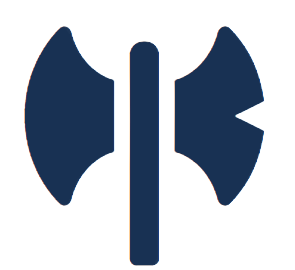

# G-COM

G-COM is an e-commerce platform for Gaming fans, Get Best Deal Here.

---

## Contains

Currently, it contains screens for the following pages

- Home, [G-Com Home](https://gcom.netlify.app/pages/home.html)
- Products, [G-Com Products](https://gcom.netlify.app/pages/product.html)
- Empty Cart, [G-Com Empty Cart](https://gcom.netlify.app/pages/cartEmpty.html)
- Cart Management, [G-Com Cart](https://gcom.netlify.app/pages/cart.html)
- Empty Wishlist, [G-Com Empty Wishlist](https://gcom.netlify.app/pages/wishListEmpty.html)
- Wishlist Management, [G-Com Wishlist](https://gcom.netlify.app/pages/wishlist.html)
- Log In, [G-Com Log In](https://gcom.netlify.app/pages/signIn.html)
- Sign Up, [G-Com Sign Up](https://gcom.netlify.app/pages/signUp.html)

---

## Connect with me

    
      

